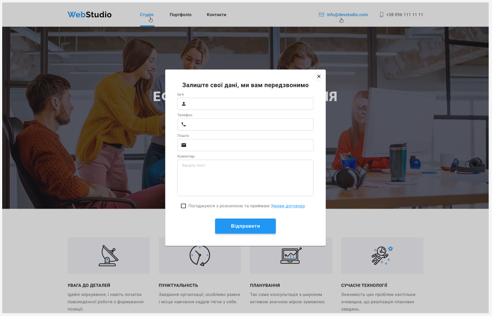

## Шаблон WebStudio

Це адаптивний та анімований шаблон веб-сайту для фіктивної компанії під назвою WebStudio. Він
побудований з використанням HTML, SCSS та інших веб-технологій. Цей файл README.md надає огляд
проекту та інструкції щодо використання та налаштування шаблону.

### Особливості

- Адаптивний дизайн: Шаблон розроблений для повної адаптації до різних розмірів екрану, включаючи
  комп'ютери, планшети та мобільні пристрої.
- Анімації: Включає різні CSS-анімації, які покращують користувацький досвід та додають
  інтерактивності на веб-сайті.
- Модальне вікно: Реалізовано модальне вікно для замовлення послуг, що дозволяє користувачам
  замовляти послуги безпосередньо на веб-сайті.
- Сучасний дизайн: Шаблон має сучасний та чистий дизайн, що робить його підходящим для представлення
  веб-студії чи агентства.

### Використані технології

- HTML: Структура та вміст шаблону написані з використанням HTML-розмітки.
- SCSS: SCSS (Sass) використовується для стилізації шаблону. Він надає більш потужний та гнучкий
  спосіб написання CSS.
- CSS: Код SCSS компілюється в CSS для сумісності з браузерами.
- JavaScript: Використовується JavaScript для обробки взаємодій та анімацій, включаючи функціонал
  модального вікна.
- Інші веб-технології: Шаблон може використовувати інші веб-технології, такі як шрифтові значки,
  сторонні бібліотеки тощо.

### Співробітництво

Ми раді приймати правки до шаблону WebStudio
